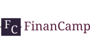
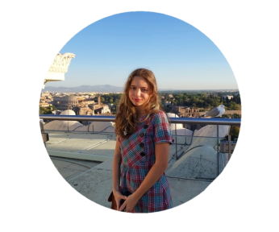
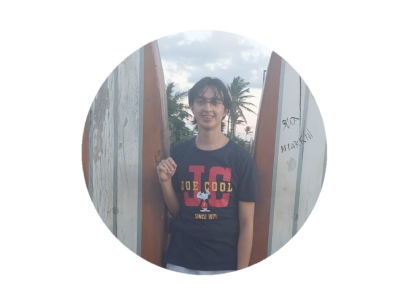

# FinanCamp | Technical Description

## Fonts
- Funds: 46295A
- Block color: D9D9D9
- Text fonts: Georgia

## Basic Structure of the Website

### Header
- Background color: #D9D9D9
- Logo image: 

### Main
- Background color: #5A464C

#### Sections
1. Home (id: home)
2. Why Join? (id: whyjoin)
3. Regulation (id: regulation)
4. Apply (id: apply)
5. Meet Us (id: meetus)
6. Contacts (id: contacts)

- All sections have the following properties:
  - Equally separated from each other
  - Top, bottom, and lateral margins
  - Background color: #D9D9D9

### Footer
- Background color: #D9D9D9
- Text: "© FinanCamp 2023 | All rights reserved"
- Text color: #271F38

## Section: Home (id: home)
- Background color: #D9D9D9
- Text color: #271F38
- Text:
  ```
  FinanCamp is a week-long program for international students that takes place entirely in English. We provide materials (and knowledge) on economics, financial mathematics, and politics. We seek engaged young people, entrepreneurs, and innovators, with autonomy and a sense of leadership. The project is free, but it is necessary to go through the selective project. Come change the world with us!
  ```
- Logo image:  (displayed beside the text)

## Section: Why Join? (id: whyjoin)
- Background color: #D9D9D9
- Text color: #271F38
- Text:
  ```
  Why join? "The leaders of the future are those who empower others." - Bill Gates
  FinanCamp helps you exercise leadership, develop teamwork, communication skills, and is a strong extracurricular addition to the curriculum. Engaging in programs like FinanCamp is extremely advantageous to gain knowledge in the area of economics and develop financial responsibility for the future!
  ```

## Section: Regulation (id: regulation)
- Background color: #D9D9D9
- Text color: #271F38
- Text: "Read our regulation and check your eligibility!"
- Logo image:  (displayed below the text)
- Button: "READ THE REGULATION"
  - Background color: #271F38
  - Text color: #FFF
  - Redirects to: [FINANCAMP_REGULATION.pdf](docs/FINANCAMP_REGULATION.pdf)

## Section: Apply (id: apply)
- Background color: #D9D9D9
- Text color: #271F38
- Text: "Sign up now! The event will take place between the 17th - 23rd of July! Sign up as soon as possible to secure your spot!"
- Button: "READ THE REGULATION"
  - Background color: #271F38
  - Text color: #FFF
  - Redirects to: [FinanCamp Application Form](https://docs.google.com/forms/d/e/1FAIpQLSfA3CtSa8lZ5pvzc6jE2qQ91RzYPdKUNeJKBYMBiuhX_UODHA/viewform)

## Section: Meet Us (id: meetus)
- Background color: #D9D9D9


- Text color: #271F38
- Text: "Meet Us"
- Div 1:
  - Id: catarina
  - Image: 
  - Text: "Catarina Carrarreto <br> Founder"
  - Instagram Button:
    - Redirects to: [Catarina's Instagram](https://www.instagram.com/catcarrareto/?igshid=MzRlODBiNWFlZA%3D%3D)
    - Image: 
  - LinkedIn Button:
    - Redirects to: "https://www.linkedin.com/in/catarina-carrareto-7203bb24a/"
    - Image: 
- Div 2:
  - Id: luiz
  - Image: 
  - Text: "Luiz Esquivel <br> Official Programmer"
  - Instagram Button:
    - Redirects to: [Luiz's Instagram](https://www.instagram.com/luizpontes.esquivel/?igshid=MzNlNGNkZWQ4Mg%3D%3D)
    - Image: 
  - LinkedIn Button:
    - Redirects to: [Luiz's LinkedIn](https://www.linkedin.com/in/luiz-eduardo-pontes-esquivel-95b62527b/)
    - Image: 

## Section: Contacts (id: contacts)
- Background color: #D9D9D9
- Text color: #271F38
- Text: "Doubts, questions, and inquiries? Contact: thefinancamp@gmail.com ccarrareto@gmail.com or visit our Instagram: @thefinancamp"